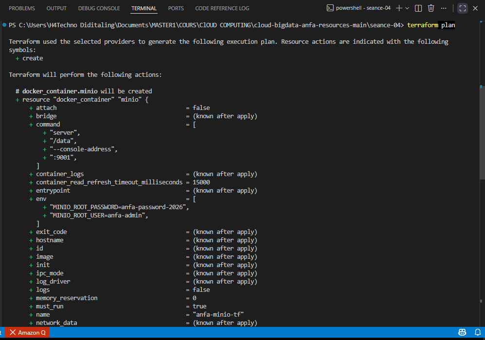
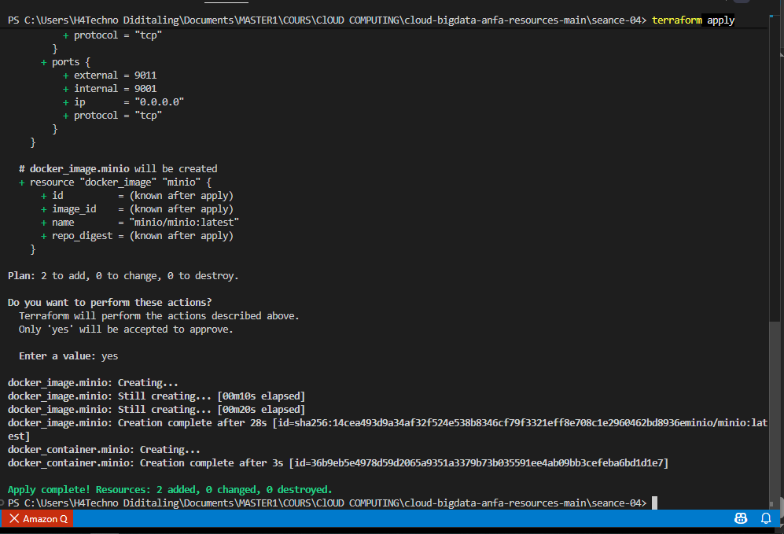
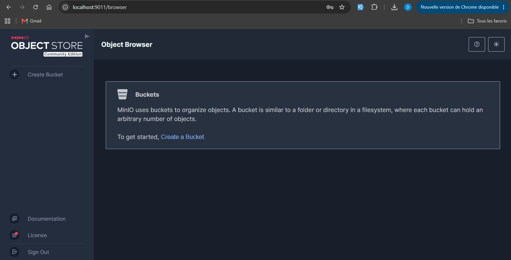
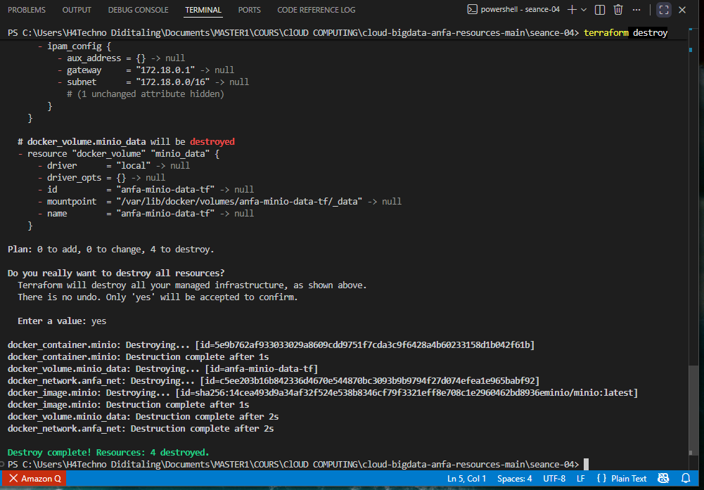

# Rendu — Séance 4

**Nom et prénom :** HODIA Essotom
**Identifiant GitHub :** H4FullStackDev 
**Date de soumission :** 27/06/2026

## Résumé de la séance

Au cours de cette séance, j'ai installé Terraform et découvert son fonctionnement en tant qu'outil d'Infrastructure as Code (IaC). J'ai déployé une infrastructure Docker complète contenant un conteneur MinIO, un réseau et un volume persistants uniquement à partir de fichiers de configuration HCL. J'ai également maîtrisé le workflow `terraform init`, `terraform plan`, `terraform apply` et `terraform destroy`, puis rendu le projet réutilisable grâce aux variables Terraform.

## Étapes principales

1. Installation et vérification de Terraform sur Windows.
2. Initialisation du projet avec `terraform init`.
3. Prévisualisation de l'infrastructure avec `terraform plan`.
4. Déploiement automatique d'un conteneur MinIO avec `terraform apply`.
5. Vérification du fonctionnement de la console MinIO.
6. Étude du fichier `terraform.tfstate` et compréhension de son rôle.
7. Mise en place du fichier `.gitignore` pour protéger les fichiers sensibles.
8. Déploiement d'une stack complète comprenant un réseau Docker, un volume persistant et un conteneur MinIO.
9. Paramétrage de l'infrastructure avec `variables.tf` et `terraform.tfvars`.
10. Vérification de l'idempotence de Terraform avec un résultat `No changes`.
11. Suppression complète de l'infrastructure avec `terraform destroy`.

## Captures d'écran

### Terraform Plan

### Terraform Apply

### Console MinIO

### Terraform Destroy

## Réponses aux exercices d'application

### Quel est le rôle de `terraform init` ?

Cette commande initialise le projet Terraform. Elle télécharge les providers nécessaires, crée le dossier `.terraform` ainsi que le fichier `.terraform.lock.hcl` afin de garantir la cohérence des versions utilisées.

### À quoi sert `terraform plan` ?

`terraform plan` permet de prévisualiser les modifications que Terraform souhaite appliquer sur l'infrastructure sans effectuer aucun changement réel. Cette étape permet de vérifier les opérations avant leur exécution.

### Quel est le rôle du fichier `terraform.tfstate` ?

Le fichier `terraform.tfstate` représente l'état réel de l'infrastructure gérée par Terraform. Il contient les identifiants des ressources ainsi que certaines informations sensibles. Il ne doit jamais être modifié manuellement ni être envoyé sur GitHub.

### Pourquoi utiliser des variables Terraform ?

Les variables permettent de rendre le code réutilisable et facilement configurable. Elles évitent de coder directement les valeurs dans les fichiers Terraform et facilitent le déploiement sur plusieurs environnements.

### Quel est l'intérêt de `terraform destroy` ?

`terraform destroy` supprime automatiquement toutes les ressources créées par Terraform dans le bon ordre, ce qui permet de nettoyer entièrement l'infrastructure sans intervention manuelle.

## Difficultés rencontrées

Au début du TP, une erreur de configuration est apparue car les fichiers `main.tf` et `main-complete.tf` étaient présents simultanément dans le projet, provoquant des définitions dupliquées. Après avoir conservé uniquement le fichier nécessaire, l'initialisation de Terraform s'est déroulée correctement. Une légère différence liée aux variables sensibles (`env`) a également été observée lors du paramétrage, puis l'infrastructure est devenue totalement idempotente avec un résultat **"No changes. Your infrastructure matches the configuration."**
