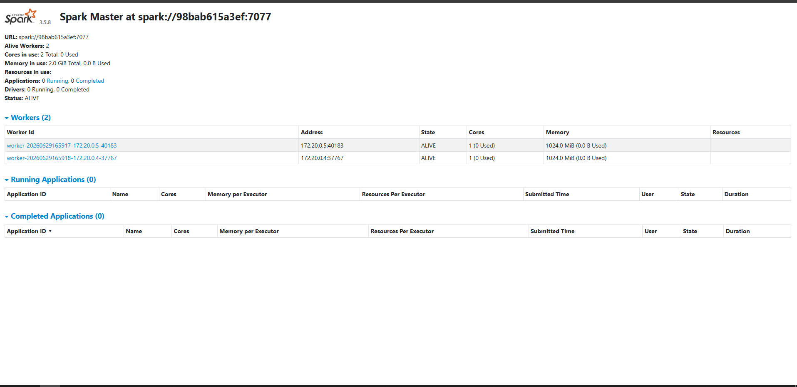
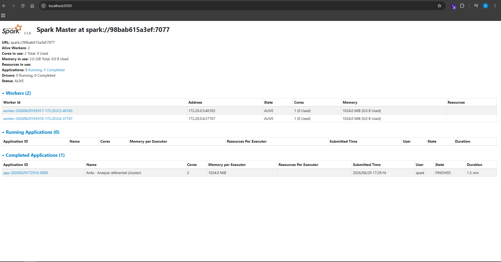
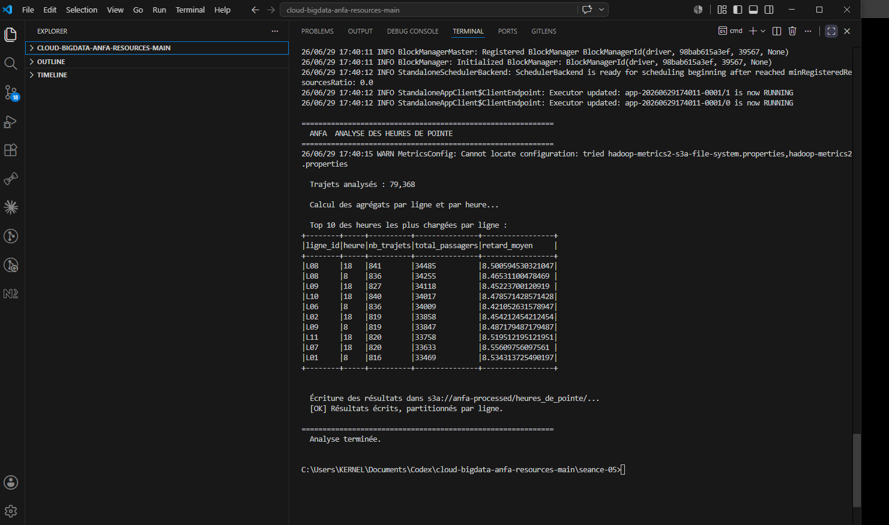
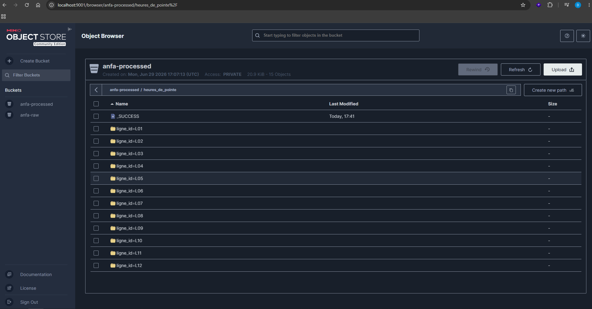

# Rendu Séance 5

**Nom et prénom :** HODIA Essotom

## Résumé de la séance

Au cours de cette séance, un cluster Spark Standalone composé d'un Spark Master et de deux Spark Workers a été déployé à l'aide de Docker Compose. Les données de référence ont été importées dans MinIO, puis plusieurs jobs PySpark distribués ont été exécutés sur le cluster afin de réaliser des traitements analytiques. Les résultats ont été stockés au format Parquet dans MinIO. Enfin, une comparaison a été réalisée entre l'exécution en mode local et l'exécution sur un cluster Spark afin d'identifier les cas d'utilisation les plus adaptés à chaque approche.

## Étapes principales

### 1. Déploiement du cluster Spark

* Création et démarrage du cluster Spark via Docker Compose.
* Vérification du bon fonctionnement du Spark Master.
* Vérification de la connexion des deux Spark Workers.

### 2. Préparation de MinIO

* Création des buckets `anfa-raw` et `anfa-processed`.
* Création d'un compte applicatif MinIO.
* Import du référentiel (CSV) dans le bucket `anfa-raw`.

### 3. Premier job Spark distribué

* Exécution du script `analyse_referentiel_cluster.py`.
* Lecture des données depuis MinIO via le connecteur S3A.
* Calcul des statistiques sur le référentiel.
* Écriture des résultats au format Parquet dans le bucket `anfa-processed`.

### 4. Analyse des heures de pointe

* Génération d'un historique simulé de trajets.
* Exécution du job `heures_de_pointe.py`.
* Agrégation des données par ligne et par heure.
* Écriture des résultats partitionnés au format Parquet dans MinIO.

### 5. Comparaison entre le mode local et le mode cluster

Une comparaison a été réalisée entre les deux modes d'exécution afin d'identifier leurs avantages respectifs selon le volume de données traité.

## Captures d'écran

### Dashboard Spark Master avec les deux Workers

### Application Spark exécutée avec succès

### Résultat du Top 10 des heures de pointe

### Données partitionnées dans MinIO

## Réflexion : mode local vs mode cluster

Pour un faible volume de données, le mode local est généralement plus rapide car il n'y a pas de coût de communication entre plusieurs machines. À l'inverse, le mode cluster introduit un léger surcoût lié à la distribution des tâches, au démarrage des executors et aux échanges réseau.

Lorsque le volume de données devient important, le cluster Spark devient plus performant. Il permet de répartir le traitement sur plusieurs machines, d'exploiter davantage de mémoire et de processeurs, et offre une meilleure tolérance aux pannes. Dès que les données dépassent les capacités d'une seule machine, l'utilisation d'un cluster devient indispensable.

## Bonus Spark sur Kubernetes

**Réalisé :** Non.

## Réponses aux exercices d'application

* Le cluster Spark est particulièrement adapté aux traitements distribués sur de grands volumes de données.
* Le Driver coordonne l'exécution des traitements tandis que les Executors réalisent les calculs.
* Le Spark Master alloue les ressources disponibles aux différents jobs.
* Les données sont lues depuis MinIO grâce au connecteur S3A puis les résultats sont écrits au format Parquet afin d'optimiser les traitements futurs.

## Difficultés rencontrées

* Adaptation de certaines commandes Linux à l'environnement Windows (CMD).
* Configuration de `spark-submit` avec les dépendances S3A nécessaires à la communication avec MinIO.
* Première exécution plus longue en raison du téléchargement automatique des dépendances Maven.

## Conclusion

Cette séance a permis de comprendre le fonctionnement d'un cluster Spark distribué ainsi que les interactions entre le Driver, le Spark Master et les Spark Workers. Les traitements distribués ont été exécutés avec succès en utilisant MinIO comme stockage objet. Cette approche constitue une base solide pour l'automatisation des traitements Big Data qui sera abordée lors de la prochaine séance avec Apache Airflow.
